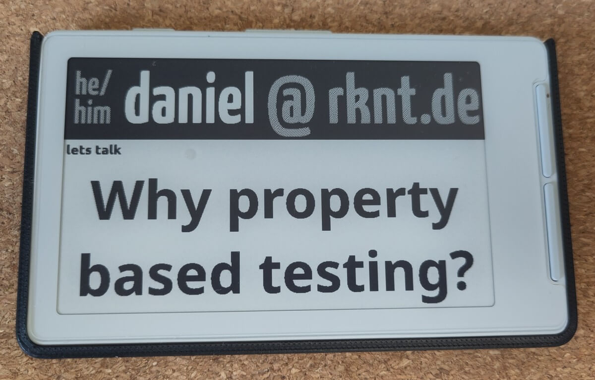

# Crosspoint Nametag Fork

- `nametag` is additional sleep screen option
- conversation topics rotate on a timer
- topics can be progressed by pressing power button
- edit topics via web UI

This is a purely vibecoded addition to the firmware. Use with appropriate caution.

## Build and install

1. `pio run`
2. copy `.pio/build/defaultfirmware.bin` to `update.bin` on root of device (using web transfer works for this)
3. power off device
4. hold up and power button
5. select `update.bin` to install

## Case

3D files and OnShape link: <https://www.printables.com/model/1845856-xteink-x4-magnetic-nametag-case>
